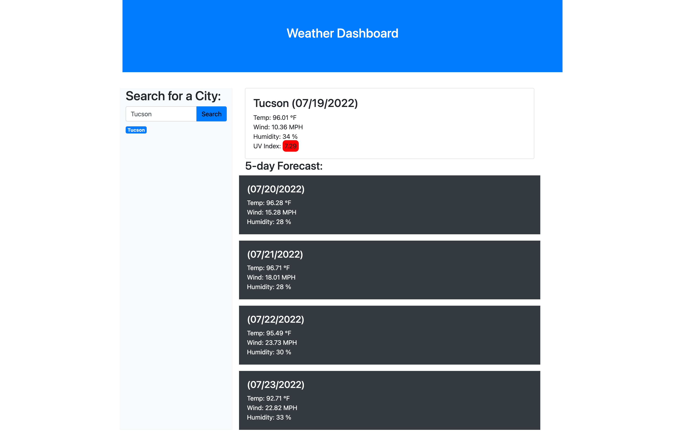

# Weather-Dashboard-Search
Weather Dashboard Application for Real-Time Weather Updates.

## Description 

A web application that would allow the user to search for a city, and be dynamically presented with real time weather data. The searched cities are stored in a City Watchlist for accessibility. 

## Criteria

* Server-side API Integration with OpenWeather API
* Search for city functionality
* Presented with the current day weather conditions (temperature, humidity, wind speed, and UV Index), as well as five day weather forecast
* Responsive and clean 
* UV Index is displayed and is dynamically represented as a highlighted color 

## Screenshots

## Live Deployed Link

[Link](https://brandtdavidson.github.io/Weather-Dashboard-Search/)

## Credits

Brandt Davidson, 2022